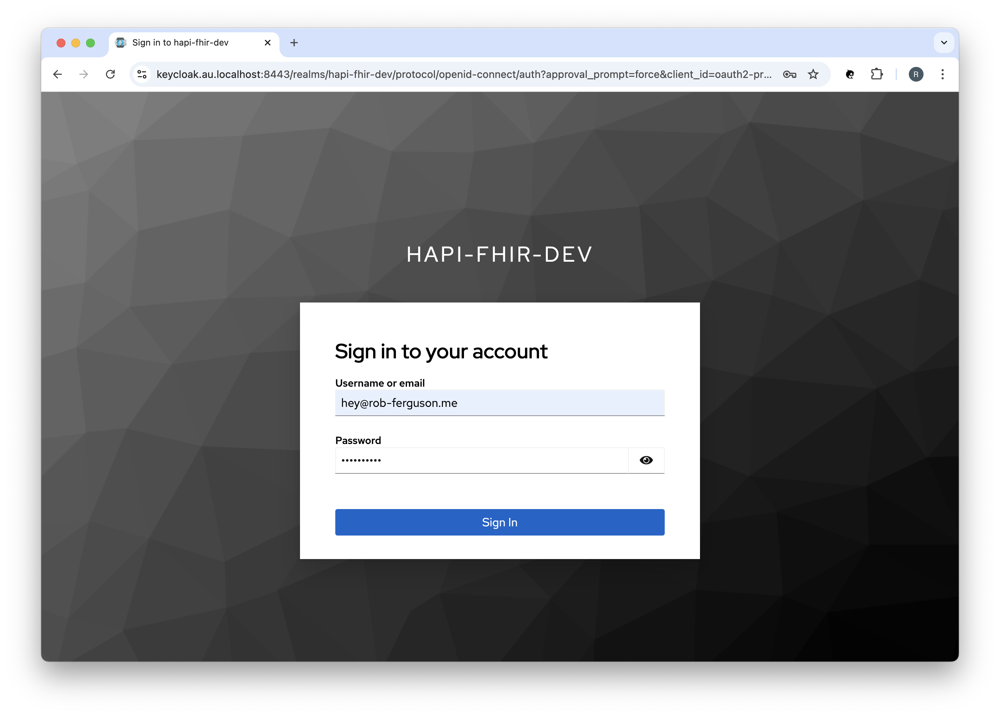
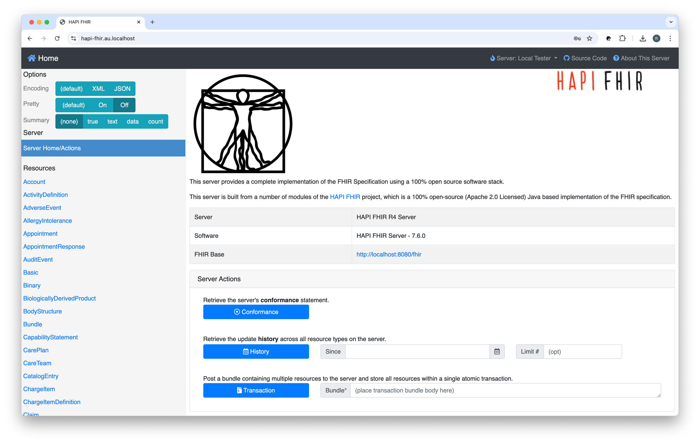
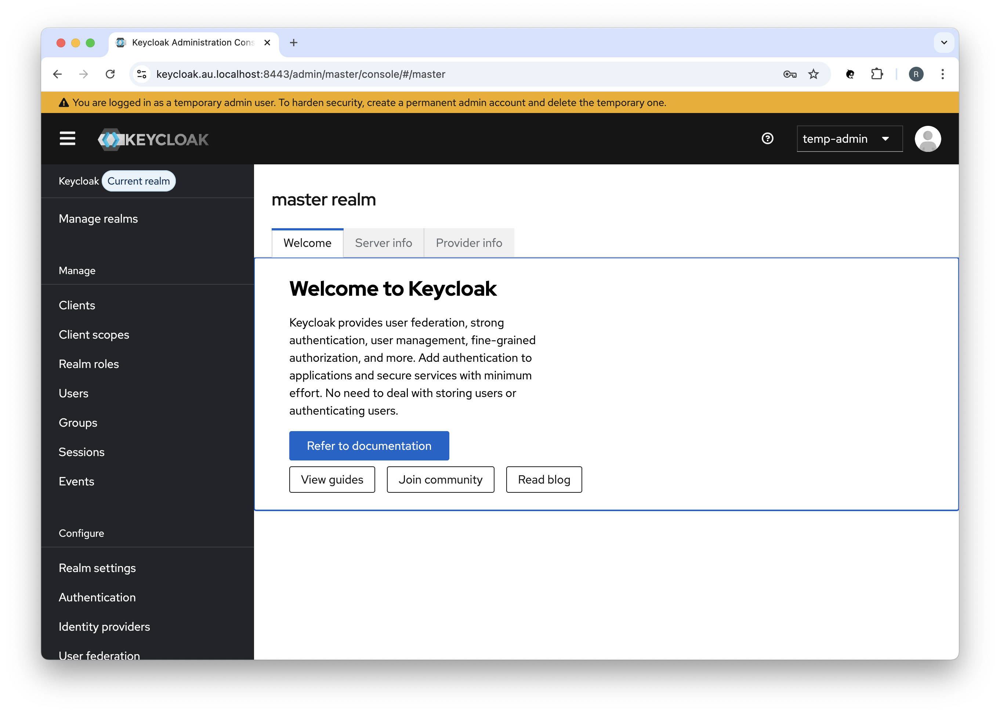
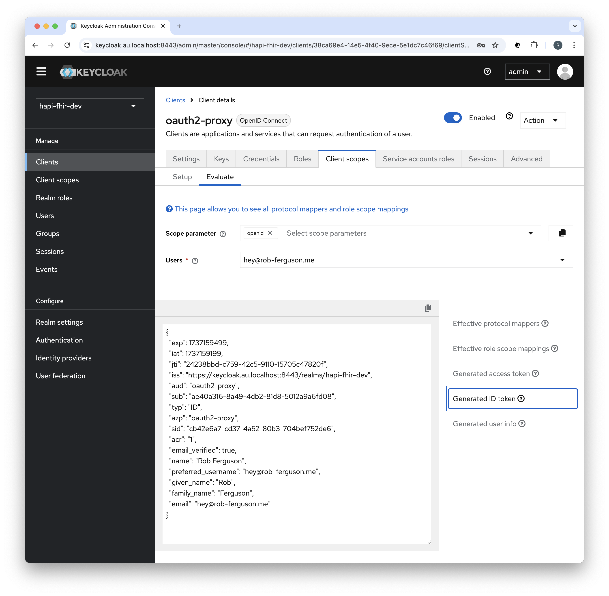

<p align="center">
  
</p>

<h1 align="center">HAPI FHIR AU with Auth Starter Project</h1>

<p align="center">
  <b>A sample HAPI FHIR with Auth Starter Project.</b> <br>
</p>

<p align="center">
  The goal of this project is to demonstrate secure access to FHIR resources using OpenID Connect for authentication and OAuth 2.0 (i.e., SMART on FHIR) for authorisation. <br>
</p>

<p align="center">
  HAPI FHIR Server Version: 8.0.0 <br>
  FHIR Version: 4.0.1 (R4) <br>
</p>


## ❯ Quick Start

### Clone the project

Change the current working directory to the location where you want the cloned project to be:

```
cd ~/workspace
```

Clone the project by running the following command:

```
git clone git@github.com:Robinyo/hapi-fhir-au.git
``` 

### Enable TLS

#### Local Development

Follow the steps in the project's Developer Documentation to use 
[mkcert](./backend/docs/developer/mkcert.md) to create and install a local certificate authority and to generate the 
certificates required to enable TLS.

### Docker Compose

With a single command, you can create and start all the services:

```
cd ~/workspace/hapi-fhir-au/backend

# APISIX
docker compose -f docker-compose-apisix.yml up

# OR

# Nginx
docker compose -f docker-compose-nginx.yml up
```

**Note:** Docker Compose will look for an `.env` file in the current working directory.

Navigate to:

```
https://hapi-fhir.au.localhost
```

You should see something like:

<p align="center">
  
</p>

Enter your username (hey@rob-ferguson.me) and password (secret), then click the 'Sign In' button to sign in using the OpenID Connect (OIDC) **Authorization Code flow**.

**Note:** I followed the steps in Keycloak's [Getting Started with Docker](https://www.keycloak.org/getting-started/getting-started-docker) guide to create: a realm; a user; and a client. 
  Keycloak will import the `hapi-fhir-dev` realm (i.e., development-realm.json) when it starts up.

<p align="center">
  
</p>

Your connection is secure:

<p align="center">
  
</p>

#### Sign out

In the Keycloak Admin Console you can sign out of the session:

<p align="center">
  
</p>

Using the browser's Developer Tools you can clear the session cookie:

<p align="center">
  
</p>

The user will be prompted to Sign in again:

<p align="center">
  
</p>

#### OpenAPI (Swagger)

Navigate to the OpenAPI (Swagger) UI for the HAPI FHIR R4 Server:

```
https://hapi-fhir.au.localhost/fhir
```

You should see something like:

<p align="center">
  
</p>

**Note:** You can override the default FHIR Server Base URL, for example:

```
hapi:
  fhir:
    server_address: https://hapi-fhir.au.localhost/fhir
```

See: [hapi.application.yaml](https://github.com/Robinyo/hapi-fhir-au/blob/main/backend/hapi.application.yaml)

To stop the services:

```
# APISIX
docker compose -f docker-compose-apisix.yml stop

# Nginx
docker compose -f docker-compose-nginx.yml stop
```

To remove the services:

```
# APISIX
docker compose -f docker-compose-apisix.yml down

# Nginx
docker compose -f docker-compose-nginx.yml down
```

To remove the data volumes:

```
docker volume rm backend_postgres_data
docker volume rm backend_cache
```

### Call the FHIR API

##### OAuth 2.0 Client Credentials Grant

You must allow the 'Service account roles' capability config setting in order to enable support for the OAuth 2.0 **Client Credentials grant**:

<p align="center">
  
</p>

#### Request a token

To access the API, you must request an access token. You will need to POST to the token URL.

For example (`scope=system/Patient.read`):

```
ACCESS_TOKEN=$(curl -s -X POST https://keycloak.au.localhost:8443/realms/hapi-fhir-dev/protocol/openid-connect/token \
  -H 'content-type: application/x-www-form-urlencoded' \
  -d grant_type=client_credentials \
  -d client_id=oauth2-proxy \
  -d client_secret=aHkRec1BYkfaKgMg164JmvKu8u9iWNHM \
  -d scope=system/Patient.read | (jq -r '.access_token'))
                 
# echo "$ACCESS_TOKEN"                 
```

**Note:** You can use [jwt.io](https://jwt.io/) to decode the access token.

#### Introspect a token

To introspect an Access Token you will need to POST to the introspect URL.

For example:

```
curl -X POST "https://keycloak.au.localhost:8443/realms/hapi-fhir-dev/protocol/openid-connect/token/introspect" \
  -H 'content-type: application/x-www-form-urlencoded' \
  -d client_id=oauth2-proxy \
  -d client_secret=aHkRec1BYkfaKgMg164JmvKu8u9iWNHM \
  -d "token_type_hint=access_token&token=$ACCESS_TOKEN"
```

#### Call the API

To call the API, an application must pass the access token as a Bearer token in the Authorization header of your HTTP request.

For example:

```
curl -X GET https://hapi-fhir.au.localhost/fhir/metadata \
  -H 'Content-Type: application/fhir+json' \
  -H "Authorization: Bearer $ACCESS_TOKEN"
```

You should see something like:

```
{
  "resourceType": "CapabilityStatement",
  "id": "e34dd06c-a04c-4612-85a7-353bdd33208e",
  "text": {
    "status": "generated",
    "div": "<div xmlns=\"http://www.w3.org/1999/xhtml\">HAPI FHIR Server</div>"
  },
  "name": "RestServer",
  "status": "active",
  "date": "2025-05-16T02:13:24Z",
  "publisher": "Not provided",
  "kind": "instance",
  "software": {
    "name": "HAPI FHIR Server",
    "version": "8.0.0"
  },
  "implementation": {
    "description": "HAPI FHIR R4 Server",
    "url": "https://hapi-fhir.au.localhost/fhir"
  },
  "fhirVersion": "4.0.1",
  "format": [ "application/fhir+xml", "xml", "application/fhir+json", "json", "application/x-turtle", "ttl", "html/json", "html/xml", "html/turtle" ],
  "patchFormat": [ "application/fhir+json", "application/fhir+xml", "application/json-patch+json", "application/xml-patch+xml" ],

    ...
    
}
```

For example:

```
curl -X GET https://hapi-fhir.au.localhost/fhir/Patient?_id=baratz-toni \
  -H 'Content-Type: application/fhir+json' \
  -H "Authorization: Bearer $ACCESS_TOKEN"
```

You should see something like:

```
{
  "resourceType": "Bundle",
  "id": "9d80c83a-0b06-4b78-bce2-21e6666348d8",
  "meta": {
    "lastUpdated": "2025-05-23T05:43:01.959+00:00"
  },
  "type": "searchset",
  "total": 1,
  "link": [ {
    "relation": "self",
    "url": "https://hapi-fhir.au.localhost/fhir/Patient?_id=baratz-toni"
  } ],
  "entry": [ {
    "fullUrl": "https://hapi-fhir.au.localhost/fhir/Patient/baratz-toni",
    "resource": {
      "resourceType": "Patient",
      "id": "baratz-toni",
      "meta": {
        "versionId": "1",
        "lastUpdated": "2025-05-23T05:42:36.551+00:00",
        "source": "#rKTCeZfmnReSjm8X",
        "profile": [ "http://hl7.org.au/fhir/core/StructureDefinition/au-core-patient" ]
      },
      "extension": [ {
        "url": "http://hl7.org.au/fhir/StructureDefinition/indigenous-status",
        "valueCoding": {
          "system": "https://healthterminologies.gov.au/fhir/CodeSystem/australian-indigenous-status-1",
          "code": "1",
          "display": "Aboriginal but not Torres Strait Islander origin"
        }
      }, {
        "url": "http://hl7.org/fhir/StructureDefinition/individual-genderIdentity",
        "extension": [ {
          "url": "value",
          "valueCodeableConcept": {
            "coding": [ {
              "system": "http://snomed.info/sct",
              "code": "446141000124107",
              "display": "Identifies as female gender"
            } ]
          }
        } ]
      }, {
        "url": "http://hl7.org/fhir/StructureDefinition/individual-pronouns",
        "extension": [ {
          "url": "value",
          "valueCodeableConcept": {
            "coding": [ {
              "system": "http://loinc.org",
              "code": "LA29519-8",
              "display": "she/her/her/hers/herself"
            } ]
          }
        } ]
      }, {
        "url": "http://hl7.org/fhir/StructureDefinition/individual-recordedSexOrGender",
        "extension": [ {
          "url": "type",
          "valueCodeableConcept": {
            "coding": [ {
              "system": "http://snomed.info/sct",
              "code": "1515311000168102",
              "display": "Biological sex at birth"
            } ]
          }
        }, {
          "url": "value",
          "valueCodeableConcept": {
            "coding": [ {
              "system": "http://snomed.info/sct",
              "code": "248152002",
              "display": "Female"
            } ]
          }
        } ]
      } ],
      "identifier": [ {
        "extension": [ {
          "url": "http://hl7.org.au/fhir/StructureDefinition/ihi-status",
          "valueCoding": {
            "system": "https://healthterminologies.gov.au/fhir/CodeSystem/ihi-status-1",
            "code": "active"
          }
        }, {
          "url": "http://hl7.org.au/fhir/StructureDefinition/ihi-record-status",
          "valueCoding": {
            "system": "https://healthterminologies.gov.au/fhir/CodeSystem/ihi-record-status-1",
            "code": "verified",
            "display": "verified"
          }
        } ],
        "type": {
          "coding": [ {
            "system": "http://terminology.hl7.org/CodeSystem/v2-0203",
            "code": "NI"
          } ],
          "text": "IHI"
        },
        "system": "http://ns.electronichealth.net.au/id/hi/ihi/1.0",
        "value": "8003608000311662"
      }, {
        "type": {
          "coding": [ {
            "system": "http://terminology.hl7.org/CodeSystem/v2-0203",
            "code": "MC"
          } ],
          "text": "Medicare Number"
        },
        "system": "http://ns.electronichealth.net.au/id/medicare-number",
        "value": "69518252411"
      } ],
      "name": [ {
        "use": "official",
        "family": "BARATZ",
        "given": [ "Toni" ]
      } ],
      "telecom": [ {
        "system": "phone",
        "value": "0870101270",
        "use": "home"
      }, {
        "system": "phone",
        "value": "0491570156",
        "use": "mobile"
      }, {
        "system": "phone",
        "value": "0870108006",
        "use": "work"
      } ],
      "gender": "female",
      "birthDate": "1978-06-16",
      "address": [ {
        "line": [ "24 Law Cir" ],
        "city": "Bassendean",
        "state": "WA",
        "postalCode": "6054",
        "country": "AU"
      } ]
    },
    "search": {
      "mode": "match"
    }
  } ]
}             
```

### Keycloak

#### Admin Console

To navigate to the Keycloak Admin Console (username: temp-admin and password: secret):

```
https://keycloak.au.localhost:8443
```

You should see something like:

<p align="center">
  
</p>

Follow these [steps](./backend/docs/administrator/keycloak.md) to create a permanent admin account.

You can preview tokens in the Keycloak Admin Console, for example:

<p align="center">
  
</p>

#### Account Console

To navigate to the Keycloak Account Console:

```
https://keycloak.au.localhost:8443/realms/hapi-fhir-dev/account
```

You should see something like:

<p align="center">
  
</p>

### Miscellaneous

Check the logs:

```
docker logs --tail 100 apisix
docker logs --tail 100 oauth2-proxy
docker logs --tail 100 keycloak
```

Clean and build:

```
docker system prune

# APISIX
docker compose -f docker-compose-apisix.yml build

# OR

# Nginx
docker compose -f docker-compose-nginx.yml build
```

Misc:

```
docker container ps -a
docker compose -f docker-compose-apisix.yml ps
docker compose -f docker-compose-nginx.yml ps
docker container ls
docker image ls
docker volume ls
```


## ❯ Resources

* Rob Ferguson's blog: [Getting Started with HAPI FHIR](https://rob-ferguson.me/getting-started-with-hapi-fhir/)
* Rob Ferguson's blog: [HAPI FHIR and FHIR Implementation Guides](https://rob-ferguson.me/hapi-fhir-and-fhir-implementation-guides/)
* Rob Ferguson's blog: [HAPI FHIR and AU Core Test Data](https://rob-ferguson.me/hapi-fhir-and-au-core-test-data/)
* Rob Ferguson's blog: [Add AuthN to HAPI FHIR with OAuth2 Proxy, Nginx and Keycloak - Part 1](https://rob-ferguson.me/add-authn-to-hapi-fhir-with-oauth2-proxy-nginx-and-keycloak-part-1/)
* Rob Ferguson's blog: [Add AuthN to HAPI FHIR with OAuth2 Proxy, Nginx and Keycloak - Part 2](https://rob-ferguson.me/add-authn-to-hapi-fhir-with-oauth2-proxy-nginx-and-keycloak-part-2/)
* Rob Ferguson's blog: [Add AuthN to HAPI FHIR with OAuth2 Proxy, Nginx and Keycloak - Part 3](https://rob-ferguson.me/add-authn-to-hapi-fhir-with-oauth2-proxy-nginx-and-keycloak-part-3/)
* Rob Ferguson's blog: [Add AuthN to HAPI FHIR with OAuth2 Proxy, Nginx and Keycloak - Part 4](https://rob-ferguson.me/add-authn-to-hapi-fhir-with-oauth2-proxy-nginx-and-keycloak-part-4/)
* Rob Ferguson's blog: [Add AuthZ to HAPI FHIR - Part 1](https://rob-ferguson.me/add-authz-to-hapi-fhir-1/)
* Rob Ferguson's blog: [Add AuthZ to HAPI FHIR - Part 2](https://rob-ferguson.me/add-authz-to-hapi-fhir-2/)
* Rob Ferguson's blog: [Add AuthN to HAPI FHIR with APISIX and Keycloak](https://rob-ferguson.me/add-authn-to-hapi-fhir-with-apisix-and-keycloak/)
* Rob Ferguson's blog: [Add support for SMART on FHIR to HAPI FHIR with APISIX and Keycloak](https://rob-ferguson.me/add-authz-to-hapi-fhir-with-apisix-and-keycloak/)

## ❯ References

### System Hardening

* Australian Signals Directorate: [Implementing Certificates, TLS, HTTPS and Opportunistic TLS](https://www.cyber.gov.au/resources-business-and-government/maintaining-devices-and-systems/system-hardening-and-administration/web-hardening/implementing-certificates-tls-https-and-opportunistic-tls)
* Cloudflare docs: [Cipher suites recommendations](https://developers.cloudflare.com/ssl/edge-certificates/additional-options/cipher-suites/recommendations/)

### OAuth 2.0

* IETF: [OAuth 2.0 for Browser-Based Applications](https://datatracker.ietf.org/doc/html/draft-ietf-oauth-browser-based-apps)
* Spring docs: [Implementation Guidelines for Browser-Based Applications](https://github.com/spring-projects/spring-authorization-server/issues/297#issue-896744390)
* okta Developer blog: [OAuth for Java Developers](https://developer.okta.com/blog/2022/06/16/oauth-java)
* OAuth.com: [OAuth 2.0 Playground](https://www.oauth.com/playground/?_gl=1*1fwid4n*_gcl_au*MjEyMTY2MzU4NS4xNzM1MDI2MjQ4*_ga*MTk3OTgwNDIxNS4xNzM1MDI2MjQ4*_ga_QKMSDV5369*MTczNjAyMjIyMS42LjEuMTczNjAyMjkyOS41Ny4wLjA.)

### HL7

* HL7: [Implementation Guide](https://www.hl7.org/fhir/implementationguide.html)
* HL7: [FHIR NPM Packages](https://hl7.org/fhir/packages.html)
* AU Core: [Publication (Version) History](https://hl7.org.au/fhir/core/history.html)
* AU Core FHIR Implementation Guide: [AU Core - 1.0.0-preview](https://hl7.org.au/fhir/core/1.0.0-preview/index.html)
* AU Core FHIR Implementation Guide: [Testing FAQs](https://confluence.hl7.org/display/HAFWG/AU+Core+FHIR+IG+Testing+FAQs)
* Sparked AU Core Test Data [Postman collection](https://github.com/hl7au/au-fhir-test-data/blob/master/Postman/Sparked%20AUCore%20Test%20Data.postman_collection.json)

### SMART on FHIR

* HL7: [SMART App Launch](https://build.fhir.org/ig/HL7/smart-app-launch/)
* SMART Health IT: [SMART on FHIR](https://docs.smarthealthit.org/)

#### SMART on FHIR - Standalone Launch

* Project Alvearie: [SMART App Launch](https://alvearie.io/blog/smart-keycloak/)
* Project Alvearie: [Keycloak extensions for FHIR](https://github.com/Alvearie/keycloak-extensions-for-fhir)
* Keycloak extensions for FHIR: [Upgrade to the Quarkus-based distribution](https://github.com/Alvearie/keycloak-extensions-for-fhir/issues/64)
* Keycloak discussion: [Fine grained scope consent management](https://github.com/keycloak/keycloak/discussions/10303)

#### SMART on FHIR - EHR Launch

* GitHub: [Zedwerks - Keycloak extensions for FHIR](https://github.com/zedwerks/keycloak-smart-fhir)

### Keycloak

* Keycloak docs: [Configuring Keycloak for production](https://www.keycloak.org/server/configuration-production)
* Keycloak docs: [Configuring TLS](https://www.keycloak.org/server/enabletls)
* Keycloak docs: [Configuring trusted certificates](https://www.keycloak.org/server/keycloak-truststore)
* Keycloak docs: [Configuring the hostname](https://www.keycloak.org/server/hostname)
* Keycloak docs: [Using a reverse proxy](https://www.keycloak.org/server/reverseproxy)
* Keycloak docs: [Running Keycloak in a container](https://www.keycloak.org/server/containers)
* Keycloak docs: [Migrating to the Quarkus distribution](https://www.keycloak.org/migration/migrating-to-quarkus)
* Keycloak docs: [Upgrading Guide - 26.1.0](https://www.keycloak.org/docs/latest/upgrading/)
* Keycloak docs: [Authorization Services Guide](https://www.keycloak.org/docs/latest/authorization_services/index.html)

### Keycloak-based  Development

* GitHub: [Keycloak Project Example](https://github.com/thomasdarimont/keycloak-project-example)
* GitHub: [Awesome Keycloak](https://github.com/thomasdarimont/awesome-keycloak)

### Keycloak Support

* Google Group: [Keycloak User](https://groups.google.com/g/keycloak-user)
* Google Group: [Keycloak Dev](https://groups.google.com/g/keycloak-dev)

### APISIX

* APISIX docs: [Deployment modes](https://apisix.apache.org/docs/apisix/deployment-modes/#standalone)
* APISIX docs: [SSL Protocol](https://apisix.apache.org/docs/apisix/ssl-protocol/)
* APISIX docs: [Certificate](https://apisix.apache.org/docs/apisix/certificate/)
* APISIX docs: [Plugins - OpenID Connect](https://apisix.apache.org/docs/apisix/plugins/openid-connect/)

### Nginx

* Nginx docs: [NGINX SSL Termination](https://docs.nginx.com/nginx/admin-guide/security-controls/terminating-ssl-http/)
* Nginx docs: [Authentication Based on Subrequest Result](https://docs.nginx.com/nginx/admin-guide/security-controls/configuring-subrequest-authentication/)

### OAuth2 Proxy

* OAuth2 Proxy docs: [Integration](https://oauth2-proxy.github.io/oauth2-proxy/configuration/integration)
* OAuth2 Proxy docs: [TLS Configuration](https://oauth2-proxy.github.io/oauth2-proxy/configuration/tls/)

### HAPI FHIR

* HAPI FHIR: [Website](https://hapifhir.io/)
* HAPI FHIR: [Documentation](https://hapifhir.io/hapi-fhir/docs/)
* Google Group: [HAPI FHIR](https://groups.google.com/g/hapi-fhir)

### Terminology

* HL7 Australia: [Terminology](https://confluence.hl7.org/display/HAFWG/Terminology)
* ADHA: [National Clinical Terminology Service](https://www.healthterminologies.gov.au/)

### Clinical Information Systems

* Oracle Health Millennium Platform: [Authorization Framework](https://docs.oracle.com/en/industries/health/millennium-platform-apis/fhir-authorization-framework/#authorization)

### okta

* okta Developer blog: [Add Auth to Any App with OAuth2 Proxy](https://developer.okta.com/blog/2022/07/14/add-auth-to-any-app-with-oauth2-proxy)
* okta forum: [SMART on FHIR wildcard scopes](https://devforum.okta.com/t/creating-wildcard-custom-scopes-for-oauth2/27418)
* GitHub: [Okta SMART on FHIR Setup Guide - scopes](https://github.com/oktadev/okta-smartfhir-docs/blob/original-v1-documentation/SETUP.md#scopes)
